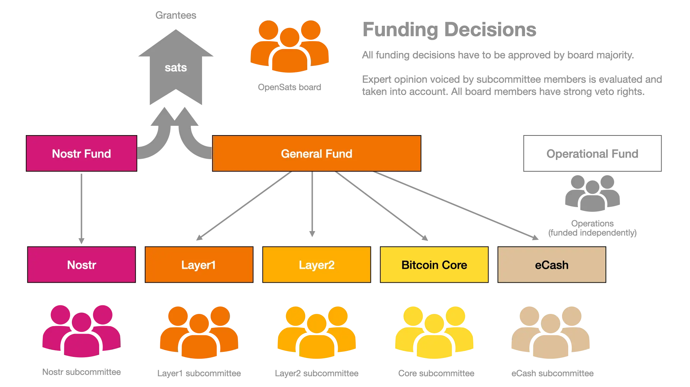

# 지원금 선정

OpenSats는 자유 오픈소스 프로젝트와 기여자를 위한 지속 가능한 펀딩 생태계를 지원하고 유지하는 것을 사명으로 삼고 있으며, 특히 Bitcoin 관련 프로젝트와 Bitcoin 생태계의 성장에 기여하는 프로젝트를 적극 지원합니다. 지원금 운영에 있어 협력적이고 쌍방향적인 접근 방식을 지향하며, 수혜자와 함께 명확한 목표 달성 경로를 갖춘 체계적인 제안서를 개발해 나갑니다.

## 지원금 규모, 복잡성, 리스크

수혜자와의 협력 수준은 지원금의 규모, 복잡성, 관련 리스크에 따라 달라집니다. 규모가 크고 복잡한 지원금의 경우 수혜자와 더욱 긴밀하게 소통하며 광범위한 파트너십을 구축합니다. 핵심 목표는 우선순위, 기대 사항, 진행 상황에 대한 합의를 이루는 것입니다. 규모가 작거나 리스크가 낮은 지원금에 대해서도 원활하고 개방적인 소통을 유지하되, 보다 가벼운 방식으로 진행합니다.

## 파트너십과 소통

수혜자와의 적절한 파트너십은 성과를 달성하는 데 핵심적인 요소입니다. 수혜자가 지원금 진행 상황, 과제, 우려 사항에 대해 저희와 솔직하게 소통하기를 권장합니다. 저희 또한 수혜자와 정기적으로 점검하며 우선순위와 기대 사항에 대한 합의를 유지하겠습니다. 성공적인 지원금 운영에는 양방향 정보 교류가 필수적이라는 점을 잘 알고 있으며, 협력과 소통의 문화를 조성하기 위해 최선을 다하고 있습니다.

## 지원금 운영 절차

지원금 운영 절차는 우리의 사명에 부합하는 필요 영역을 파악하는 것에서부터 시작합니다. 이후 제안서를 평가하기 위한 명확한 기준을 수립하여, 전략적 우선순위에 부합하고 목표 달성으로 향하는 뚜렷한 경로를 갖추고 있는지 확인합니다. 또한 지원자의 역량과 집중도를 고려하여 우리의 사명 및 지원 우선순위에 적합한지 판단합니다.

지원 제안서를 접수하면 기준 충족 여부와 사명과의 부합 여부를 꼼꼼하게 검토합니다. 필요에 따라 지원자와 논의하여 제안서를 보완하고, 체계적으로 다듬어 목표 달성을 위한 명확한 경로를 갖추도록 합니다. 아울러 지원 기간 동안 수혜자와 긴밀하게 협력하며 진행 상황을 모니터링하고 의도한 성과를 달성할 수 있도록 합니다.

## 지원 제안서 심사 절차

모든 지원 신청서는 동일한 다단계 심사 절차를 거칩니다. 지원금의 분야와 성격에 따라 다양한 분야의 전문가가 자원하여 기술적 실현 가능성과 영향력을 평가합니다. 일부 프로젝트 제안서는 영향 영역이 겹칠 수 있지만, 저희가 접수하는 지원 신청서의 대부분은 다음 다섯 가지 범주 중 하나에 해당합니다:

## 펀딩 결정 구조

저희는 지원 신청서에 대해 철저하고 엄격한 심사 절차를 운영하고 있습니다. 제안서가 우리의 사명과 우선순위에 부합하고, 체계적으로 작성되었으며, 의도한 성과를 달성할 수 있는 명확한 경로를 갖추고 있는지 확인하는 것을 목표로 합니다.

## 절차는 5단계로 구성됩니다:

1. [초기 심사](#1-initial-screening)
2. [종합 검토](#2-comprehensive-review)
3. [실사](#3-due-diligence)
4. [최종 결정](#4-final-decision)
5. [지원 계약 및 모니터링](#5-grant-agreement-and-monitoring)

### 1단계: 초기 심사

심사 절차는 신청서가 우리의 사명과 우선순위에 부합하는지를 확인하는 초기 심사로 시작합니다. 지원자의 역량과 집중도를 함께 고려하여 적합성을 판단할 수 있습니다. 초기 심사를 통과한 신청서는 다음 심사 단계로 넘어갑니다.

### 2단계: 종합 검토

종합 검토 단계에서는 명확한 기준에 따라 제안서를 심층적으로 평가합니다.

주요 평가 기준은 다음과 같습니다:

- 우리의 사명 및 우선순위와의 부합 여부
- 목적과 목표의 명확성
- 제안된 프로젝트 또는 연구의 실현 가능성
- 지원자의 역량과 전문성
- 프로젝트의 잠재적 영향력과 확장 가능성

지원자의 제안서를 더 잘 이해하고 추가 질문을 하기 위해 논의를 진행할 수도 있습니다. 이 단계의 목표는 의도한 성과를 달성할 수 있는 명확한 경로를 갖추고 우리의 사명에 부합하는 제안서를 선별하는 것입니다. 필요에 따라 해당 분야 전문가를 참여시켜 지원자의 과거 오픈소스 기여 활동을 평가할 수 있습니다.

### 3단계: 실사

우리의 사명과 우선순위에 부합하는 제안서를 선별한 후, 제안된 프로젝트 또는 연구의 실현 가능성을 확인하고 지원자가 프로젝트를 성공적으로 수행할 수 있는 역량과 전문성을 갖추고 있는지 검증하기 위해 실사(due diligence)를 수행합니다. 실사에는 재무 제표 및 참고 자료 검토, 과거 협업자 및 추천인과의 면담 등이 포함될 수 있습니다.

### 4단계: 최종 결정

종합 검토와 실사 절차를 바탕으로 지원 제안서에 대한 최종 결정을 내립니다. 제안서의 전반적인 영향력, 확장 가능성, 지원자의 프로젝트 수행 역량을 종합적으로 고려합니다. 또한 해당 지원금이 전체 지원금 포트폴리오와 우리의 사명에 어떻게 부합하는지도 검토할 수 있습니다. 모든 지원금은 이사회의 과반수 승인을 필요로 합니다.

### 5단계: 지원 계약 및 모니터링

최종 결정이 내려지면 수혜자와 협력하여 지원금의 범위, 마일스톤, 보고 요건을 명시한 지원 계약을 체결합니다. 지원금이 의도한 성과를 달성하고 수혜자가 자금을 책임감 있게 사용하고 있는지 면밀하게 모니터링합니다.

## 결론

OpenSats는 지원 제안서에 대해 철저하고 엄격한 심사 절차를 운영하고 있습니다. 이 절차를 통해 제안서가 우리의 사명과 우선순위에 부합하고, 체계적으로 작성되었으며, 의도한 성과를 달성할 수 있는 명확한 경로를 갖추고 있는지 확인합니다. 제안서의 실현 가능성, 영향력, 확장 가능성을 보장하기 위해 수혜자와 긴밀히 협력하며, 지원금이 의도한 성과를 달성할 수 있도록 진행 상황을 면밀히 모니터링합니다.
